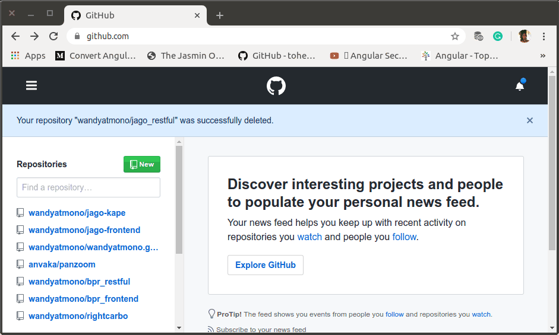

`Sunday, July, 14 2019`

**`12:19`**

## Create New Remote and Check The Local Repository

0.  Create New Remote Repository

    Setelah signin ke https://github.com/wandyatmono, langsung create new.

    <p align="center">
        
        <br />Figure: aa.03.01.github.init.gif
    </p>

1.  Check hasil initialisasi direktori proyek baru

    ```bash

    `package.json`

    ```bash
    $ head -20 package.json 
    {
        "name": "restful",
        "version": "1.0.0",
        "description": "Restful API Server for Jago project.",
        "main": "index.js",
        "directories": {
            "doc": "docs"
        },
        "scripts": {
            "test": "echo \"Error: no test specified\" && exit 1"
        },
        "keywords": [
            "jago",
            "restful",
            "api"
        ],
        "author": "Joko Wandyatmono",
        "license": "ISC"
    }
    ```

## Install `express`, `mysql` dan `body-parser` packages

    ```bash
    $ sudo npm install --save express mysql body-parser
    [sudo] password for wandyatmono: 
    npm notice created a lockfile as package-lock.json. You should commit this file.
    npm WARN restful@1.0.0 No repository field.

    + body-parser@1.19.0
    + express@4.17.1
    + mysql@2.18.1
    added 59 packages from 48 contributors and audited 171 packages in 28.409s
    found 0 vulnerabilities
    ```

## Preparation for Git And Push to Git

0. Git Version

    ```bash
    $ git --version
    git version 2.25.0
    ```

1. Global Config

    ```bash
    $ git config --global user.name "wandyatmono"
    $ git config --global user.email emond.swd@gmail.com
    $ git config --list
    user.name=wandyatmono
    user.email=emond.swd@gmail.com
    ```

2. Prepare a file for README.

    Sebagai pedoman untuk membuat README.mdS dapat diambil default style yang ada di
    https://github.com/RichardLitt/standard-readme/blob/master/README.md akan tetapi saya memilih
    untuk membuat README.md dengan menyalin petunjuk singkat yang diperoleh saat pertama-kali repository selesai dibuat.

3. Git Init

    ```bash
    $ git init
    Initialized empty Git repository in /home/wandyatmono/projects/jago/restful/.git/


    $ git status
    On branch master

    No commits yet

    Untracked files:
    (use "git add <file>..." to include in what will be committed)
        README.md
        docs/
        node_modules/
        package-lock.json
        package.json

    nothing added to commit but untracked files present (use "git add" to track)
    ```

4. Create `.gitignore`

    ```bash
    $ touch .gitignore
    $ echo "/node_modules" >> .gitignore
    ```

## First Revision

0. Stage

    ```bash
    $ git add .
    wandyatmono@ubuntu-devenvo:~/projects/bpr/restful$ git status
    $ git status
    On branch master

    No commits yet

    Changes to be committed:
    (use "git rm --cached <file>..." to unstage)
        new file:   .gitignore
        new file:   README.md
        new file:   docs/aa.00.create.project.md
        new file:   docs/aa.01.devenvo.check.md
        new file:   docs/aa.02.devenvo.mysql.md
        new file:   docs/aa.03.devenvo.project.init.md
        new file:   docs/figures/.goutputstream-Z1U5G0
        new file:   docs/figures/aa.03.01.github.init.gif
        new file:   docs/figures/byzanz-record-window
        new file:   docs/notes/00.byzanz.gif.screencaster.md
        new file:   package-lock.json
        new file:   package.json
    ```

1. Seringkali `.gitignore` terlupa dibuat disaat awal pembuatan local-repo.

    Berikut adalah contoh pembuatan `.gitignore` yang terlambat, pengecualikan `node_modules` dan penghapusan direktori tersebut dari stage-cache.

    ```bash
    $ touch .gitignore
    $ echo "/node_modules" >> .gitignore
    $ git rm -r --cached node_modules
    $ git add .
    ```

**`14:55`**